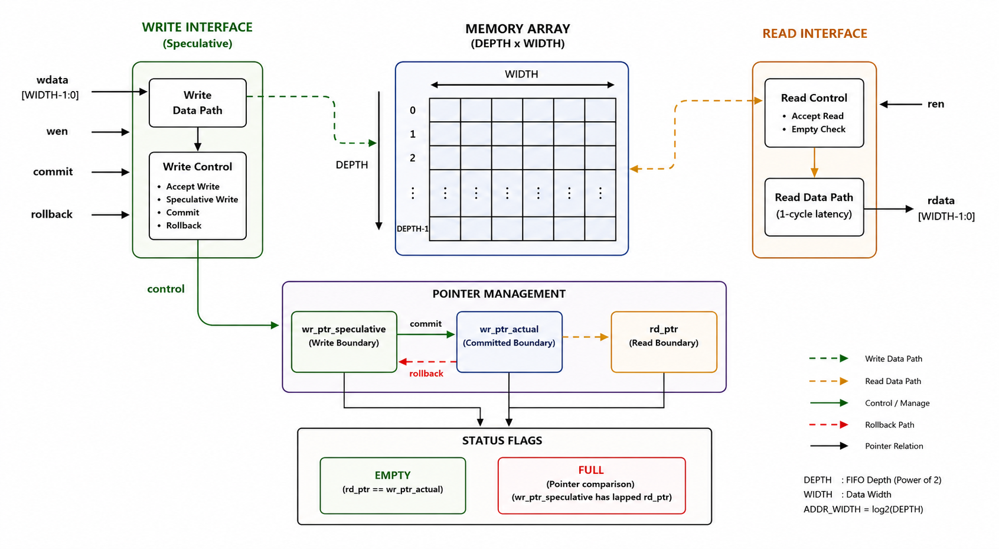

# Synchronous Transactional FIFO

## Overview
This repository contains the RTL design and verification environment for a Synchronous Transactional FIFO. Unlike a standard FIFO, this architecture features a transactional memory engine that allows for speculative data writing. It supports `commit` operations to make staged data official, and `rollback` operations to instantly discard uncommitted data without corrupting the memory array.

## Key Features
*   **Speculative Execution:** Separate actual and speculative write pointers allow blocks of data to be staged before committing.
*   **Hardware Rollback:** An active-high `rollback` signal instantly purges uncommitted data via single-cycle pointer realignment.
*   **Dual-Port Concurrency:** Inferred dual-port RAM seamlessly handles simultaneous read and write collisions.
*   **Robust Protection:** Native hardware gating prevents read underflow and write overflow memory corruption.
## System Architecture 

## Results & KPIs
*   **Low Area Footprint:** Used just 26 LUTs (0.04% of a standard FPGA), keeping the logic highly efficient.
*   **Solid Speed:** Synthesized with a minimal datapath delay of ~7.6 ns, allowing the FIFO to comfortably operate at ~131 MHz.
*   **True Core Power:** Draws approximately 325 mW dynamically (isolating the internal silicon logic from unoptimized external I/O pad overhead).

## Testing & Verification Methodology
The design was verified using a 12-stage, fully automated self-checking testbench in Xilinx Vivado (XSim). 
*   **Automated Error Checking:** The testbench automatically flags mismatched data during simulation, eliminating the need for manual waveform inspection.
*   **Protocol Stress Tests:** Simulated real-world traffic by throwing simultaneous writes, commits, and rollbacks at the design to guarantee data integrity.
*   **Corner Cases:** Purposely targeted hardware limits to test extreme scenarios, including full/empty N+1 bit pointer wrap-arounds, asynchronous mid-flight resets, and exact-clock-edge read/write collisions.
*   **Setup/Hold Realism:** All testbench stimulus is driven on the negative clock edge (`negedge`) to avoid simulation race conditions. 

*Result: The design passed the exhaustive verification sequence with zero errors.*

## Repository Structure
*   `/rtl` - Contains the synthesizable Verilog source code (`transactional_fifo.v`).
*   `/tb` - Contains the automated self-checking testbench (`tb_transactional_fifo.v`).
*   `/results` - Contains Vivado synthesis schematics, performance reports, and the 0-error simulation waveform.

## Authors
*   **Rudrapratapsinh Rathod**
*   **Vishv Gorasiya**
*   **Jeet Sakariya**

Dhirubhai Ambani University (DAU)
